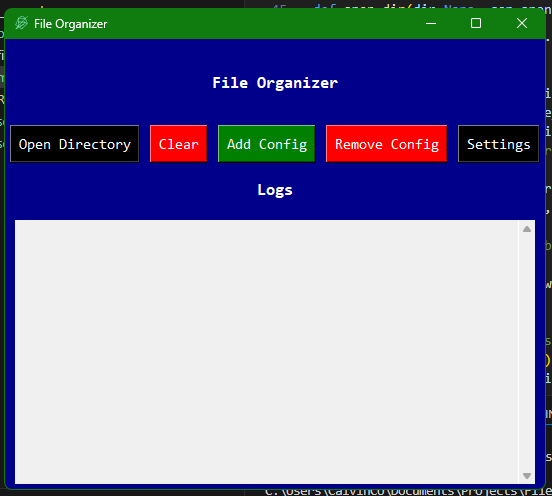

# 🧹 File-Cleaner
> This is a script that will organizer the folders in a directory to folders based on their file type.



## 🛠️ Built With
- **tkinter** — GUI framework
- **time** — time and date handling
- **os** — file path handling
- **shutil** — for file movement
- **json** — for saving configurations in a file
- **winreg** — for startup configuration
- **pystray** — for system tray in background

## ✨ Features
- ✨ Custom file extension configuration options
- 🚀 App Startup 
- 🥷 Background Sorting
-  Startup function

## 🚀 Installation
```bash
pip install pystray, tkinter
python main.py
```

## 📸 Screenshots

